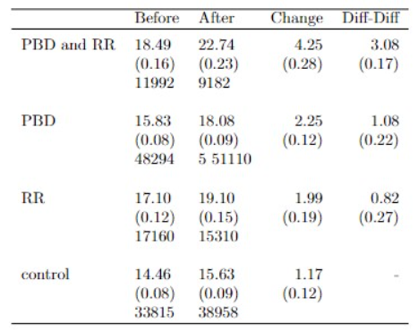

**Performed by :**

-   GOMEZ Jean-Baptiste


In this replication, we will reproduce in R the results obtained in the article :

Lalive, R. van Ours, J. and J. Zweimuller (2006), “How Changes in Financial Incentives Affect the Duration of Unemployment.” The Review of Economic Studies, 73, 4, 1009-1038.

## 1 Research objectives

### **Q1 What are the contributions of this study ?**

The objective of the paper submitted to our reading is to identify the impact of the improvement of the unemployment system in terms of financial and compensation duration on the duration of unemployment. Indeed, in this paper, the authors focus on two parameters such as the benefit replacement rate (RR) and the benefit duration ( PBD) whose improvement makes the unemployment system more generous and attractive. This paper therefore identifies the effect of these attractive changes on the unemployment duration behavior of unemployed workers.

In this context, the authors exploit a policy change in 1989 introduced by the Austrian government. The stable macroeconomic context of Austria in 1989 implies that the study in this paper is less prone to endogenous policy biases than other studies. The data used are quite complete and informative and available over a long period (unemployed entrants 2 years before the change and 2 years after the change). These data are taken from the Austrian social security database and the Austrian unemployment register. The policy used affected the unemployed heterogeneously. Groups of unemployed were assigned different treatments. A first group experienced an increase in RR, i.e. the replacement rate of benefits, the second group experienced an extension of PBD, i.e. the duration of benefits, the third group experienced both an improvement in RR and PBD, and a fourth group that had no treatment, i.e. no change. Referring to the theoretical literature, increasing the RR plus and/or extending the PBD will reduce the optimal job search effort of an unemployed person, resulting in a longer unemployment duration. Even more, this duration would be longer for unemployed workers who receive both changes simultaneously.

Similarly, other empirical studies lead to the same conclusion, with some differences. Indeed, some previous studies on the impact of the increase in the PBD are distorted by the endogeneity of the policies. Also, this earlier literature is problematic because of the possibility that unobserved heterogeneity distorts identification in cross-sectional data.

In this paper, a new approach using a piecewise exponential proportional hazard (PWE PH) model is implemented by the authors. After a descriptive analysis of the different eligible groups, the authors use a diff-diff method to measure the impact of the treatment for each group, followed by an analysis with a survival function and a PWE PH Model. Exploring the results of this study, we find that the increase in RR and PBD affects the behavior of individuals and therefore increases the duration of unemployment. This confirms the theory on this subject. These results are convincing given their coherence and conformity with the theory, the methodology used, the political context of the study and especially that they make a sensitivity analysis that leads to almost the same conclusions.


## 2 Background

The authors seek to identify the causal effect of benefit duration on the willingness of individuals to accept jobs using a policy change that took place in Austria in 1989.

The policy affected various unemployed workers differently: a first group experienced an increase in RR (replacement rate); a second group experienced an extension of PBD (potential benefit duration); a third group experienced both changes; and a fourth group experienced no change (the control group).

The potential benefit duration was increased, depending on age and experience: For workers younger than 40 and who had little previous work experience, the potential benefit duration remained unchanged. For workers with high levels of previous work experience, the duration has increased.

## 3 Data Preparation
The data are provided in the data set fi.dta. This file, which contains 225,821 unemployment spells, is quite large (150 MB) as it also contains the interaction terms used in the PH model estimation.

### **Q2 : Replication Table 4**

#### Data Preparation


```r
#libraries requires
library(foreign)  # for: read.dta
# do not use haven::read_dta since this messes up `udat$type` factor labels
library(tidyverse)
library(survival)
library(psych)
library(dplyr)
library(epiR)
library(KernSmooth)
library(stargazer)
```


```r
udat <- read.dta("C:/Users/gomez/OneDrive/Documents/Master 2 EBDS & MAG3/Master 2 EBDS/Transition and duration models/projet/Project Master 2/fi.dta")  
udat <- udat[,1:134] # get rid of some superfluous variables
udat <- as_tibble(udat)

dim(udat)  # N = 225,821
```

```
## [1] 225821    134
```

Our database comprises **225,821** records across **134** variables.


```r
glimpse(udat[,1:36])
```

```
## Rows: 225,821
## Columns: 36
## $ beginn   <dbl> 10412, 10169, 10624, 10343, 10654, 10101, 10652, 10338, 10705…
## $ ein_zus  <dbl> 0, 0, 0, 0, 0, 0, 0, 0, 0, 0, 0, 0, 0, 0, 0, 0, 0, 0, 1, 0, 0…
## $ sfrau    <dbl> 0, 1, 1, 0, 0, 0, 1, 1, 1, 0, 0, 1, 1, 1, 1, 1, 1, 0, 1, 1, 0…
## $ age      <dbl> 51.13758, 54.71595, 54.04791, 54.11636, 46.13005, 42.11909, 5…
## $ after    <dbl> 0, 0, 0, 0, 0, 0, 0, 0, 0, 0, 0, 0, 0, 0, 0, 0, 0, 0, 0, 0, 0…
## $ dur      <dbl> 0.1428571, 0.1428571, 0.1428571, 0.1428571, 0.1428571, 0.1428…
## $ nwage_pj <dbl> 11282.729, 8577.623, 6828.051, 10071.884, 6342.333, 6094.196,…
## $ e3_5     <dbl> 1, 1, 1, 0, 1, 1, 1, 0, 1, 1, 1, 1, 1, 1, 1, 1, 1, 1, 1, 1, 1…
## $ bdur     <dbl> 30, 30, 30, 20, 30, 30, 30, 20, 30, 30, 30, 30, 30, 30, 30, 3…
## $ y1988    <dbl> 1, 0, 0, 1, 0, 0, 0, 1, 0, 1, 1, 0, 0, 1, 1, 1, 0, 1, 0, 1, 1…
## $ y1989    <dbl> 0, 0, 1, 0, 1, 0, 1, 0, 1, 0, 0, 0, 0, 0, 0, 0, 1, 0, 1, 0, 0…
## $ y1990    <dbl> 0, 0, 0, 0, 0, 0, 0, 0, 0, 0, 0, 0, 0, 0, 0, 0, 0, 0, 0, 0, 0…
## $ y1991    <dbl> 0, 0, 0, 0, 0, 0, 0, 0, 0, 0, 0, 0, 0, 0, 0, 0, 0, 0, 0, 0, 0…
## $ med_educ <dbl> 0, 0, 0, 0, 0, 0, 0, 1, 0, 0, 0, 0, 0, 0, 0, 0, 0, 0, 0, 0, 0…
## $ hi_educ  <dbl> 0, 0, 0, 0, 0, 0, 0, 0, 0, 0, 0, 0, 0, 0, 0, 0, 0, 0, 0, 0, 0…
## $ lehre    <dbl> 1, 0, 0, 0, 1, 1, 0, 0, 1, 0, 1, 1, 0, 0, 0, 0, 1, 0, 0, 1, 0…
## $ married  <dbl> 1, 0, 1, 0, 0, 0, 1, 0, 0, 1, 0, 0, 1, 1, 1, 1, 1, 0, 1, 1, 1…
## $ single   <dbl> 0, 1, 0, 0, 0, 0, 0, 0, 0, 0, 0, 0, 0, 0, 0, 0, 0, 0, 0, 0, 0…
## $ divorced <dbl> 0, 0, 0, 1, 1, 1, 0, 1, 1, 0, 1, 0, 0, 0, 0, 0, 0, 1, 0, 0, 0…
## $ f_marr   <dbl> 0, 0, 1, 0, 0, 0, 1, 0, 0, 0, 0, 0, 1, 1, 1, 1, 1, 0, 1, 1, 0…
## $ f_single <dbl> 0, 1, 0, 0, 0, 0, 0, 0, 0, 0, 0, 0, 0, 0, 0, 0, 0, 0, 0, 0, 0…
## $ f_divor  <dbl> 0, 0, 0, 0, 0, 0, 0, 1, 1, 0, 0, 0, 0, 0, 0, 0, 0, 0, 0, 0, 0…
## $ bc       <dbl> 1, 1, 1, 1, 1, 1, 1, 1, 1, 0, 1, 0, 1, 1, 1, 1, 0, 1, 0, 1, 1…
## $ pnon_10  <dbl> 0.2651971579, 0.1003559679, 0.1081599146, 0.3736308813, 0.033…
## $ q2       <dbl> 0, 0, 0, 1, 0, 0, 0, 1, 1, 0, 0, 0, 0, 0, 0, 0, 1, 0, 1, 0, 1…
## $ q3       <dbl> 1, 0, 0, 0, 0, 1, 0, 0, 0, 0, 0, 1, 0, 0, 0, 1, 0, 0, 0, 0, 0…
## $ q4       <dbl> 0, 1, 0, 0, 0, 0, 0, 0, 0, 0, 0, 0, 1, 0, 0, 0, 0, 1, 0, 0, 0…
## $ seasonal <dbl> 1, 1, 1, 0, 0, 1, 0, 1, 1, 0, 0, 0, 0, 0, 0, 0, 0, 1, 0, 0, 0…
## $ manuf    <dbl> 0, 0, 0, 1, 0, 0, 0, 0, 0, 1, 0, 0, 0, 1, 1, 0, 1, 0, 0, 0, 0…
## $ ten72    <dbl> -3.47749186, -1.04384339, 0.23723496, -2.63423371, -2.5197806…
## $ type     <fct> PBD and RR, PBD and RR, PBD and RR, PBD and RR, PBD and RR, P…
## $ uncc     <dbl> 1, 1, 1, 1, 1, 1, 1, 1, 1, 1, 1, 1, 1, 1, 1, 1, 1, 1, 1, 1, 1…
## $ lwage    <dbl> 6.173206, 5.918063, 5.645761, 6.059680, 5.571968, 5.576242, 5…
## $ tr       <dbl> 1, 1, 1, 1, 1, 1, 1, 1, 1, 1, 1, 1, 1, 1, 1, 1, 1, 1, 1, 1, 1…
## $ t39      <dbl> 0, 0, 0, 0, 1, 1, 0, 1, 1, 1, 1, 1, 1, 1, 1, 0, 1, 1, 0, 1, 0…
## $ t52      <dbl> 1, 1, 1, 1, 0, 0, 1, 0, 0, 0, 0, 0, 0, 0, 0, 1, 0, 0, 1, 0, 1…
```

Groups are defined by the type variable, which is coded as a factor (levels can be examined using `levels(udat$type))`.


```r
table(udat$type)
```

```
## 
## PBD and RR        PBD         RR    control 
##      21174      99404      32470      72773
```

In the database, the groups are varied. Notably, **PBD** stands out as the most prevalent, represented by **99,404** entries.


```r
# Computation of average spells when durations are truncated at 104 weeks
udat %>%
  mutate(dur104 = dur,
         dur104 = ifelse(dur104 > 104, 104, dur104)) ->
  udat
```

The first and second columns of **Table 4** in the article correspond to the columns labeled *n* (number of observations), *mean*, and *standard error*. These details are obtained using the `describe` function.

**Descriptive statistics**


```r
#Describe the data 
#To represent two first columns of the table 4 
desc_stat = describeBy(udat$dur104,
group=list(udat$type,udat$after),mat = T)
desc_stat
```

```
## # A tibble: 8 × 16
##   item  group1  group2  vars     n  mean    sd median trimmed   mad    min   max
##   <chr> <chr>   <chr>  <dbl> <dbl> <dbl> <dbl>  <dbl>   <dbl> <dbl>  <dbl> <dbl>
## 1 1     PBD an… 0          1 11992  18.5  17.7   14.1    15.5 11.4  0.0712   104
## 2 2     PBD     0          1 48294  15.8  16.6   11.5    12.7  8.24 0.0712   104
## 3 3     RR      0          1 17160  17.1  15.5   13.8    14.8 10.1  0.0712   104
## 4 4     control 0          1 33815  14.5  14.4   11.0    12.0  8.03 0.0712   104
## 5 5     PBD an… 1          1  9182  22.7  22.3   15.2    18.7 13.0  0.0712   104
## 6 6     PBD     1          1 51110  18.1  20.6   11.4    13.6  8.03 0.0712   104
## 7 7     RR      1          1 15310  19.1  18.8   14.1    15.6 11.0  0.142    104
## 8 8     control 1          1 38958  15.6  17.2   10.8    12.2  7.60 0.0712   104
## # ℹ 4 more variables: range <dbl>, skew <dbl>, kurtosis <dbl>, se <dbl>
```


```r
#Rename variables
desc_stat <- desc_stat %>% rename(type=group1,after=group2,m=mean,N=n)
desc_stat
```

```
## # A tibble: 8 × 16
##   item  type     after  vars     N     m    sd median trimmed   mad    min   max
##   <chr> <chr>    <chr> <dbl> <dbl> <dbl> <dbl>  <dbl>   <dbl> <dbl>  <dbl> <dbl>
## 1 1     PBD and… 0         1 11992  18.5  17.7   14.1    15.5 11.4  0.0712   104
## 2 2     PBD      0         1 48294  15.8  16.6   11.5    12.7  8.24 0.0712   104
## 3 3     RR       0         1 17160  17.1  15.5   13.8    14.8 10.1  0.0712   104
## 4 4     control  0         1 33815  14.5  14.4   11.0    12.0  8.03 0.0712   104
## 5 5     PBD and… 1         1  9182  22.7  22.3   15.2    18.7 13.0  0.0712   104
## 6 6     PBD      1         1 51110  18.1  20.6   11.4    13.6  8.03 0.0712   104
## 7 7     RR       1         1 15310  19.1  18.8   14.1    15.6 11.0  0.142    104
## 8 8     control  1         1 38958  15.6  17.2   10.8    12.2  7.60 0.0712   104
## # ℹ 4 more variables: range <dbl>, skew <dbl>, kurtosis <dbl>, se <dbl>
```


```r
# selection of interest variables
Stat_Final <- desc_stat %>%
  select(type, after, N, m, se)

Stat_Final
```

```
## # A tibble: 8 × 5
##   type       after     N     m     se
##   <chr>      <chr> <dbl> <dbl>  <dbl>
## 1 PBD and RR 0     11992  18.5 0.162 
## 2 PBD        0     48294  15.8 0.0757
## 3 RR         0     17160  17.1 0.118 
## 4 control    0     33815  14.5 0.0782
## 5 PBD and RR 1      9182  22.7 0.233 
## 6 PBD        1     51110  18.1 0.0912
## 7 RR         1     15310  19.1 0.152 
## 8 control    1     38958  15.6 0.0870
```

## 4 Difference-in-Differences

**Compute Change and Diff-in-Diff**

Now we want to construct the two last columns. We will create a function that calculate the change and diff in diff


```r
#Define a new table for type for this function 
udat$type_2 = as.factor(udat$type)

levels(udat$type_2) = c("PBD_and_RR","PBD","RR","control")

table(udat$type_2)
```

```
## 
## PBD_and_RR        PBD         RR    control 
##      21174      99404      32470      72773
```


```r
#The function call Change_and_diff_diff

Change_and_diff_diff<-function(group){

# We use t_test to calculate the change between means, so we perform it for group
  
test_group = t.test(dur104 ~ after, data = subset(udat,type_2==group)) 

change_1 = test_group$estimate[2] - test_group$estimate[1] #Difference between means for treatment group

#We also perform t_test for control group

test_control = t.test(dur104 ~ after, data =subset(udat,type_2=="control")) 

change_2 = test_control$estimate[2] -test_control$estimate[1] #Difference between means for control group

#Extract the standard error from t_test

se = test_group$stderr 

#Calcule diff_in_diff

DD=change_1-change_2

d1 = data.frame(table(change_1,se,DD))

print(d1[ , !(names(d1) %in% c("Freq"))])
print(group)

cat("\n")}

Result<-for (i in c("PBD","RR","PBD_and_RR","control")){
Change_and_diff_diff(i)}
```

```
##           change_1                se              DD
## 1 2.24895765012454 0.118526843363783 1.0795373713288
## [1] "PBD"
## 
##           change_1                se               DD
## 1 1.98780293225122 0.192599987232714 0.81838265345548
## [1] "RR"
## 
##           change_1                se               DD
## 1 4.25140790178893 0.283662075620519 3.08198762299319
## [1] "PBD_and_RR"
## 
##           change_1                se DD
## 1 1.16942027879574 0.116977067129766  0
## [1] "control"
```

For previous result, the group name is just under of his different statistics (change_1,se,DD)

We want to get the standard error for Diff-in-Diff and to achieve this we should estimate the model , OLS and get the standard error for diff_in_diff for each group


```r
#Create a data for each group

#PBD exist print 1 otherwise 0
udat$type_PBD =ifelse(udat$type =='PBD',1, 0)
#control exist print 1 otherwise 0
udat$type_control=ifelse(udat$type == 'control',1 ,0)
#RR exist print 1 otherwise 0
udat$type_RR= ifelse(udat$type == 'RR',1,0)
#PBD and RR exist print 1 otherwise 0
udat$type_PBD_and_RR=ifelse(udat$type == "PBD and RR" ,1,0)
```


```r
#Estimate ols to get standard error of diff_in_diff
OLS_pbd <- lm(dur104 ~ after + type_PBD + type_PBD*after,
data = subset(udat,(type_PBD==1)|(type_control==1)))

OLS_RR <- lm(dur104 ~ after + type_RR + type_RR*after,
data = subset(udat,(type_RR==1)|(type_control==1)))

OLS_PBD_and_RR <- lm(dur104 ~ after + type_PBD_and_RR + type_PBD_and_RR*after,
data = subset(udat,(type_PBD_and_RR==1)|(type_control==1)))
```

Finaly we get this table construct in latex to have a same form as table


```r
knitr::include_graphics("C:/Users/gomez/OneDrive/Documents/Master 2 EBDS & MAG3/Master 2 EBDS/Transition and duration models/projet/Project Master 2/final_result_gomez.png")
```



**Interpretation:** In this table PBD have a biggest change for means before and After. Also, when the politics is take place,PBD increase to 3.08 the unemployment duration.


## 5 Survival Function
### **Q3 (Survival Functions) Seek to reproduce Figure 3 in Lalive et al. (2006).**

We want to represent graphically the survival function


```r
#Define dur104_bis to create the survival  based on dur104 and  uncc 

udat$dur104_bis = Surv(udat$dur104,udat$uncc)

#For each group estimate the survfit 

survfit_PBD <- survfit(subset(udat, type =="PBD")$dur104_bis ~ subset(udat, type =="PBD")$after)
survfit_RR <- survfit(subset(udat, type == "RR")$dur104_bis ~ subset(udat, type =="RR")$after)
survfit_PBDRR <- survfit(subset(udat, type == "PBD and RR")$dur104_bis ~ subset(udat, type =="PBD and RR")$after)
survfit_control<- survfit(subset(udat, type == "control")$dur104_bis~ subset(udat, type =="control")$after)
```

Create function that plot the previous survival fit


```r
#we create a function plot with many options that we use for each group plot 
plot_survival_fit<-function(fit,title){
par(xpd = T, mar = par()$mar + c(0,0,0,0))
plot(fit, xlab="Unemployment duration (weeks)", ylab="Survivor", lty=2:1,xaxt="n")
legend("topright", c("After","Before"),lty=1:2,bty = "n",horiz=FALSE);title(title)
xtick<-seq(0, 104, by=10)
axis(side=1, at=xtick, labels = as.character(xtick),cex.axis=0.7)
}
```


```r
#Plot graphics

#par(mfrow=c(1,2))
par(mfrow = c(1, 2))

plot_survival_fit(survfit_PBD,'PBD')
plot_survival_fit(survfit_RR,'RR')
```

<!-- -->

```r
plot_survival_fit(survfit_PBDRR,'PBDRR')
plot_survival_fit(survfit_control,'Control')
```

<!-- -->

**Interpretation:** The visuals closely resemble those found in the article, and it can be concluded that as time progresses, the survival rate decreases more swiftly in scenarios where there is a concurrent enhancement in both PBD and RR. Additionally, at the onset of the unemployment period, an uptick in the survival function is observed.

### 5.1 KM estimates of the unemployment exit hazard

#### **Q4 (KM estimates of the unemployment exit hazard): Seek to reproduce Figure 4 in Lalive et al. (2006).**


```r
#We define a new variable name dur_km

udat$dur_km = Surv(udat$dur,udat$uncc)

pbd_km.fit <- survfit(subset(udat, type == 'PBD')$dur_km ~ subset(udat, type =='PBD')$after)
rr_km.fit <- survfit(subset(udat, type == 'RR')$dur_km ~ subset(udat, type =='RR')$after)
pbdrr_km.fit <- survfit(subset(udat, type == 'PBD and RR')$dur_km ~ subset(udat, type =='PBD and RR')$after)
control_km.fit <- survfit(subset(udat, type == 'control')$dur_km ~ subset(udat, type =='control')$after)
```


```r
#Estimate Hazard model
haz_pbd_km <- epi.insthaz(pbd_km.fit,conf.level = 0.95)
haz_rr_km <- epi.insthaz(rr_km.fit,conf.level = 0.95)
haz_pbdrr_km <- epi.insthaz(pbdrr_km.fit,conf.level = 0.95)
haz_control_km <- epi.insthaz(control_km.fit,conf.level = 0.95)
```


```r
#Create 2 function to plot Hazard model

#Smooth is locpoly
plot_hazard_poly <-function(data, after_, smoother ="locpoly" , b=NULL,type_plot = "plot",y_lim ){{
  d = data.frame(time = locpoly(subset(data,strata == after_)$time,
                                subset(data,strata == after_)$hlow,bandwidth = b)$x,
hest = locpoly(subset(data,strata == after_)$time,subset(data,strata == after_)$hest, bandwidth = b)$y)}

if (type_plot=="plot"){
plot(x = d$time, y = d$hest, xlab = "Unemployment duration(weeks)",xlim = c(0,100),ylab = "Hazard",ylim= y_lim ,type ="l",xaxt="n",lty = 1,cex.axis=0.7)
xtick<-seq(0, 100, by=20)
axis(side=1, at=xtick, labels = as.character(xtick),cex.axis=0.7)
} else
{
lines(x = d$time, y = d$hest,lty = 2)
}
}
```


```r
#Smooth is lowess
plot_hazard_lowess <-function(data, after_, smoother ="lowess" , f1=NULL,type_plot = "plot",y_lim ){{
d = data.frame(time = lowess(subset(data,strata == after_)$time,
subset(data,strata == after_)$hlow,f = f1)$x,
hest = lowess(subset(data,strata == after_)$time,subset(data,strata == after_)$hest, f=f1)$y)}
  
if (type_plot=="plot"){
plot(x = d$time, y = d$hest, xlab = "Unemployment duration(weeks)",xlim = c(0,100),ylab = "Hazard",ylim= y_lim ,type ="l",xaxt="n",lty = 1,cex.axis=0.7)
xtick<-seq(0, 100, by=20)
axis(side=1, at=xtick, labels = as.character(xtick),cex.axis=0.7)
} else
{
lines(x = d$time, y = d$hest,lty = 2)
}
}
```


**Graphics**


```r
#Plot graphic for each group

options(repr.plot.width=30, repr.plot.height=30);par(mfrow=c(1,2))

plot_hazard_poly(data=haz_pbd_km, after_=1, smoother ="locpoly", b = 1.5, type_plot= "plot",y_lim =c(0,0.15))
plot_hazard_poly(data=haz_pbd_km, after_=0, smoother ="locpoly", b =1.3, type_plot= "lines")
legend("topright", c("After","Before"),lty=1:2,bty = "n",horiz=FALSE);title('PBD increase')

plot_hazard_lowess(data=haz_rr_km, after_=1, smoother ="lowess", f1= 0.2, type_plot ="plot",y_lim =c(0,1.5))
plot_hazard_lowess(data=haz_rr_km, after_=0, smoother ="lowess", f1=0.002,type_plot = "lines")
legend("topright", c("After","Before"),lty=1:2,bty = "n",horiz=FALSE); title('RR increase')
```

<!-- -->

```r
plot_hazard_poly(data=haz_pbdrr_km, after_=1, smoother ="locpoly", b= 1.5,type_plot = "plot",y_lim =c(0,0.15))
plot_hazard_poly(data=haz_pbdrr_km, after_=0, smoother ="locpoly", b = 1.3, type_plot= "lines")
legend("topright", c("After","Before"),lty=1:2,bty = "n",horiz=FALSE);title('PBD and RR increase')

plot_hazard_lowess(data=haz_control_km, after_=1, smoother ="lowess", f1= 0.02,type_plot = "plot",y_lim =c(0,2))
plot_hazard_lowess(data=haz_control_km, after_=0, smoother ="lowess", f1 = 0.0002,type_plot = "lines")
legend("topright", c("After","Before"),lty=1:2,bty = "n",horiz=FALSE); title('Control')
```

<!-- -->

For theses graphs we don’t have the same results for RR and Control but the graph of PBD and PBDRR is similarly to graphs in article.

## 6 Estimating the causal treatment effect in a PH model


```r
#sample data , we choose a sample of 3000 to reduce the time of fitting 
sample = as.integer(length(udat$dur)*runif(3000))
sam_udat <- udat[sample,]
```


```r
udat %>%
  mutate(all = tr * (t39 + t52) ) ->
  udat

breaks <- seq(from=3,to=59, by=4)
labels <- paste("(", c(0,breaks), ",", c(breaks,104), "]",sep="")

gux <- survSplit(Surv(dur104,uncc) ~., data=udat, cut = breaks,
                 end = "time", event="death", start="start", episode="interval")

gux %>%
  mutate(exposure = time - start,
        interval=factor(interval+1, labels = labels) ) ->
  gux
```


### **Q5 Estimate the causal treatment effect in a PH model.**


```r
#Equation of the model
equation <- death ~ interval*(t39 + t52 + tr + (t39 + t52)*tr + after0 + t39*after0 +t52*after0 + tr*after0 + t39*tr*after0 + t52*tr*after0)

#Fit model and summary
model_pwe <- glm(equation, offset = log(exposure), data = gux, family= poisson)
summary(model_pwe)
```

```
## 
## Call:
## glm(formula = equation, family = poisson, data = gux, offset = log(exposure))
## 
## Deviance Residuals: 
##     Min       1Q   Median       3Q      Max  
## -1.6966  -0.7054  -0.5698  -0.3897   4.1404  
## 
## Coefficients:
##                                  Estimate Std. Error  z value Pr(>|z|)    
## (Intercept)                    -3.5068716  0.0184931 -189.632  < 2e-16 ***
## interval(3,7]                   0.6321219  0.0224281   28.184  < 2e-16 ***
## interval(7,11]                  1.0465830  0.0220096   47.551  < 2e-16 ***
## interval(11,15]                 1.2091526  0.0228596   52.895  < 2e-16 ***
## interval(15,19]                 1.1689210  0.0250653   46.635  < 2e-16 ***
## interval(19,23]                 1.2312663  0.0274070   44.925  < 2e-16 ***
## interval(23,27]                 0.8972142  0.0340630   26.340  < 2e-16 ***
## interval(27,31]                 0.9989592  0.0366195   27.279  < 2e-16 ***
## interval(31,35]                 0.8597073  0.0446020   19.275  < 2e-16 ***
## interval(35,39]                 0.4712684  0.0590446    7.982 1.44e-15 ***
## interval(39,43]                 0.3259327  0.0690351    4.721 2.34e-06 ***
## interval(43,47]                 0.2035552  0.0793254    2.566 0.010286 *  
## interval(47,51]                 0.0665838  0.0909763    0.732 0.464241    
## interval(51,55]                -0.0603505  0.1032009   -0.585 0.558691    
## interval(55,59]                -0.1485793  0.1140170   -1.303 0.192530    
## interval(59,104]               -0.0928093  0.0469119   -1.978 0.047887 *  
## t39                             0.0013365  0.0256002    0.052 0.958363    
## t52                            -0.1991984  0.0394780   -5.046 4.52e-07 ***
## tr                             -0.1470277  0.0334783   -4.392 1.12e-05 ***
## after0                         -0.0346931  0.0254777   -1.362 0.173291    
## t39:tr                          0.2239138  0.0513286    4.362 1.29e-05 ***
## t52:tr                          0.2749645  0.0802211    3.428 0.000609 ***
## t39:after0                      0.0267326  0.0357125    0.749 0.454127    
## t52:after0                      0.0644713  0.0532854    1.210 0.226308    
## tr:after0                      -0.0242894  0.0484898   -0.501 0.616429    
## interval(3,7]:t39              -0.0173804  0.0310709   -0.559 0.575904    
## interval(7,11]:t39             -0.0349364  0.0304956   -1.146 0.251953    
## interval(11,15]:t39            -0.0006506  0.0315411   -0.021 0.983543    
## interval(15,19]:t39             0.0221355  0.0344816    0.642 0.520905    
## interval(19,23]:t39            -0.3711869  0.0394325   -9.413  < 2e-16 ***
## interval(23,27]:t39            -0.2724780  0.0476559   -5.718 1.08e-08 ***
## interval(27,31]:t39            -0.0013308  0.0486167   -0.027 0.978162    
## interval(31,35]:t39            -0.0713459  0.0595649   -1.198 0.231001    
## interval(35,39]:t39             0.0855650  0.0761807    1.123 0.261359    
## interval(39,43]:t39             0.0930405  0.0890825    1.044 0.296286    
## interval(43,47]:t39             0.0629058  0.1029042    0.611 0.540998    
## interval(47,51]:t39             0.0574905  0.1181746    0.486 0.626622    
## interval(51,55]:t39             0.1120645  0.1326106    0.845 0.398075    
## interval(55,59]:t39            -0.0317239  0.1505286   -0.211 0.833082    
## interval(59,104]:t39           -0.0593972  0.0625049   -0.950 0.341970    
## interval(3,7]:t52               0.0989404  0.0471145    2.100 0.035729 *  
## interval(7,11]:t52              0.1053792  0.0460941    2.286 0.022244 *  
## interval(11,15]:t52             0.2531509  0.0467967    5.410 6.32e-08 ***
## interval(15,19]:t52             0.3470597  0.0501859    6.915 4.66e-12 ***
## interval(19,23]:t52            -0.0589211  0.0580190   -1.016 0.309844    
## interval(23,27]:t52            -0.0893865  0.0708176   -1.262 0.206874    
## interval(27,31]:t52             0.0852331  0.0712043    1.197 0.231298    
## interval(31,35]:t52            -0.2919731  0.0934345   -3.125 0.001779 ** 
## interval(35,39]:t52            -0.2590088  0.1177959   -2.199 0.027893 *  
## interval(39,43]:t52            -0.4369614  0.1416495   -3.085 0.002037 ** 
## interval(43,47]:t52            -0.4661548  0.1592467   -2.927 0.003420 ** 
## interval(47,51]:t52            -0.2725775  0.1663539   -1.639 0.101309    
## interval(51,55]:t52             0.6660912  0.1453424    4.583 4.59e-06 ***
## interval(55,59]:t52             0.1050470  0.1849745    0.568 0.570103    
## interval(59,104]:t52            0.2841016  0.0740498    3.837 0.000125 ***
## interval(3,7]:tr               -0.1826450  0.0412852   -4.424 9.69e-06 ***
## interval(7,11]:tr              -0.2236680  0.0402648   -5.555 2.78e-08 ***
## interval(11,15]:tr             -0.3326517  0.0417427   -7.969 1.60e-15 ***
## interval(15,19]:tr             -0.3162197  0.0445806   -7.093 1.31e-12 ***
## interval(19,23]:tr              0.3868902  0.0439882    8.795  < 2e-16 ***
## interval(23,27]:tr              0.3851750  0.0531561    7.246 4.29e-13 ***
## interval(27,31]:tr              0.3757594  0.0572002    6.569 5.06e-11 ***
## interval(31,35]:tr              0.3848074  0.0695896    5.530 3.21e-08 ***
## interval(35,39]:tr              0.3508969  0.0928020    3.781 0.000156 ***
## interval(39,43]:tr              0.0060502  0.1190136    0.051 0.959456    
## interval(43,47]:tr              0.2100604  0.1281223    1.640 0.101103    
## interval(47,51]:tr             -0.1043423  0.1612558   -0.647 0.517593    
## interval(51,55]:tr              0.2179915  0.1644764    1.325 0.185050    
## interval(55,59]:tr              0.2622913  0.1797118    1.460 0.144425    
## interval(59,104]:tr             0.1030339  0.0777626    1.325 0.185178    
## interval(3,7]:after0            0.0007036  0.0308746    0.023 0.981819    
## interval(7,11]:after0           0.0925061  0.0301285    3.070 0.002138 ** 
## interval(11,15]:after0          0.0548152  0.0314104    1.745 0.080962 .  
## interval(15,19]:after0         -0.1742491  0.0351637   -4.955 7.22e-07 ***
## interval(19,23]:after0         -0.1429425  0.0379968   -3.762 0.000169 ***
## interval(23,27]:after0         -0.0744207  0.0464387   -1.603 0.109032    
## interval(27,31]:after0         -0.2141358  0.0506927   -4.224 2.40e-05 ***
## interval(31,35]:after0         -0.2628003  0.0612531   -4.290 1.78e-05 ***
## interval(35,39]:after0         -0.1158072  0.0779169   -1.486 0.137202    
## interval(39,43]:after0         -0.1631297  0.0913252   -1.786 0.074059 .  
## interval(43,47]:after0         -0.2761417  0.1064805   -2.593 0.009504 ** 
## interval(47,51]:after0         -0.3577038  0.1231334   -2.905 0.003672 ** 
## interval(51,55]:after0         -0.1791698  0.1334414   -1.343 0.179374    
## interval(55,59]:after0         -0.1921913  0.1471061   -1.306 0.191389    
## interval(59,104]:after0        -0.0591534  0.0593037   -0.997 0.318539    
## t39:tr:after0                  -0.1118465  0.0776739   -1.440 0.149881    
## t52:tr:after0                  -0.3714863  0.1252256   -2.967 0.003012 ** 
## interval(3,7]:t39:tr           -0.0781648  0.0640053   -1.221 0.222001    
## interval(7,11]:t39:tr          -0.1740376  0.0629883   -2.763 0.005727 ** 
## interval(11,15]:t39:tr         -0.2455119  0.0655812   -3.744 0.000181 ***
## interval(15,19]:t39:tr         -0.1782185  0.0695208   -2.564 0.010361 *  
## interval(19,23]:t39:tr         -0.4526959  0.0724551   -6.248 4.16e-10 ***
## interval(23,27]:t39:tr         -0.4221699  0.0851258   -4.959 7.07e-07 ***
## interval(27,31]:t39:tr         -0.2572047  0.0843078   -3.051 0.002282 ** 
## interval(31,35]:t39:tr         -0.0731342  0.1011598   -0.723 0.469706    
## interval(35,39]:t39:tr         -0.2195742  0.1331025   -1.650 0.099012 .  
## interval(39,43]:t39:tr          0.0762942  0.1654657    0.461 0.644736    
## interval(43,47]:t39:tr         -0.1592732  0.1867827   -0.853 0.393815    
## interval(47,51]:t39:tr          0.2082991  0.2232289    0.933 0.350759    
## interval(51,55]:t39:tr         -0.1610613  0.2406449   -0.669 0.503310    
## interval(55,59]:t39:tr         -0.3088768  0.2808364   -1.100 0.271399    
## interval(59,104]:t39:tr        -0.1668659  0.1194686   -1.397 0.162494    
## interval(3,7]:t52:tr           -0.2966012  0.1008553   -2.941 0.003273 ** 
## interval(7,11]:t52:tr          -0.4125548  0.0988978   -4.172 3.03e-05 ***
## interval(11,15]:t52:tr         -0.3278592  0.0986413   -3.324 0.000888 ***
## interval(15,19]:t52:tr         -0.4216100  0.1044846   -4.035 5.46e-05 ***
## interval(19,23]:t52:tr         -0.4949734  0.1080226   -4.582 4.60e-06 ***
## interval(23,27]:t52:tr         -0.3402834  0.1253169   -2.715 0.006620 ** 
## interval(27,31]:t52:tr         -0.3320422  0.1260306   -2.635 0.008423 ** 
## interval(31,35]:t52:tr         -0.3001194  0.1633098   -1.838 0.066102 .  
## interval(35,39]:t52:tr         -0.0201588  0.1955760   -0.103 0.917904    
## interval(39,43]:t52:tr         -0.2709920  0.2775556   -0.976 0.328890    
## interval(43,47]:t52:tr          0.0349044  0.2700176    0.129 0.897146    
## interval(47,51]:t52:tr          0.0369651  0.3116299    0.119 0.905577    
## interval(51,55]:t52:tr         -0.0382059  0.2474482   -0.154 0.877295    
## interval(55,59]:t52:tr          0.2764737  0.2997715    0.922 0.356382    
## interval(59,104]:t52:tr        -0.2101053  0.1414451   -1.485 0.137433    
## interval(3,7]:t39:after0        0.0005765  0.0433186    0.013 0.989381    
## interval(7,11]:t39:after0      -0.0064427  0.0422887   -0.152 0.878911    
## interval(11,15]:t39:after0      0.0072026  0.0439157    0.164 0.869724    
## interval(15,19]:t39:after0     -0.0373163  0.0492077   -0.758 0.448246    
## interval(19,23]:t39:after0     -0.1013128  0.0561249   -1.805 0.071054 .  
## interval(23,27]:t39:after0     -0.1642152  0.0669899   -2.451 0.014232 *  
## interval(27,31]:t39:after0     -0.5647522  0.0719771   -7.846 4.29e-15 ***
## interval(31,35]:t39:after0     -0.4359765  0.0855303   -5.097 3.44e-07 ***
## interval(35,39]:t39:after0      0.0303629  0.1001723    0.303 0.761809    
## interval(39,43]:t39:after0      0.3144864  0.1157237    2.718 0.006576 ** 
## interval(43,47]:t39:after0      0.3775252  0.1352365    2.792 0.005245 ** 
## interval(47,51]:t39:after0      0.2905410  0.1577337    1.842 0.065479 .  
## interval(51,55]:t39:after0      0.1334438  0.1717506    0.777 0.437181    
## interval(55,59]:t39:after0      0.2283023  0.1934576    1.180 0.237954    
## interval(59,104]:t39:after0     0.0800432  0.0799462    1.001 0.316723    
## interval(3,7]:t52:after0       -0.1029911  0.0639170   -1.611 0.107109    
## interval(7,11]:t52:after0      -0.1248582  0.0621840   -2.008 0.044656 *  
## interval(11,15]:t52:after0     -0.2091617  0.0635467   -3.291 0.000997 ***
## interval(15,19]:t52:after0     -0.3746837  0.0700494   -5.349 8.85e-08 ***
## interval(19,23]:t52:after0     -0.4884634  0.0810174   -6.029 1.65e-09 ***
## interval(23,27]:t52:after0     -0.5621861  0.0977532   -5.751 8.87e-09 ***
## interval(27,31]:t52:after0     -0.8650170  0.1032580   -8.377  < 2e-16 ***
## interval(31,35]:t52:after0     -0.5298603  0.1270396   -4.171 3.03e-05 ***
## interval(35,39]:t52:after0     -0.5047868  0.1532801   -3.293 0.000990 ***
## interval(39,43]:t52:after0     -0.1440547  0.1766103   -0.816 0.414692    
## interval(43,47]:t52:after0      0.1315257  0.1957624    0.672 0.501670    
## interval(47,51]:t52:after0      0.4189509  0.2032547    2.061 0.039283 *  
## interval(51,55]:t52:after0      0.8730070  0.1761009    4.957 7.14e-07 ***
## interval(55,59]:t52:after0      0.7620470  0.2205898    3.455 0.000551 ***
## interval(59,104]:t52:after0    -0.0087585  0.0936286   -0.094 0.925470    
## interval(3,7]:tr:after0        -0.0178834  0.0598673   -0.299 0.765155    
## interval(7,11]:tr:after0       -0.0339348  0.0579859   -0.585 0.558396    
## interval(11,15]:tr:after0      -0.0268573  0.0602625   -0.446 0.655834    
## interval(15,19]:tr:after0       0.0358286  0.0654261    0.548 0.583953    
## interval(19,23]:tr:after0      -0.0287106  0.0636924   -0.451 0.652156    
## interval(23,27]:tr:after0       0.0818370  0.0750080    1.091 0.275253    
## interval(27,31]:tr:after0      -0.0275176  0.0826344   -0.333 0.739131    
## interval(31,35]:tr:after0      -0.1127801  0.1000801   -1.127 0.259785    
## interval(35,39]:tr:after0      -0.1250660  0.1274169   -0.982 0.326322    
## interval(39,43]:tr:after0       0.1778417  0.1575847    1.129 0.259089    
## interval(43,47]:tr:after0       0.0593493  0.1748691    0.339 0.734314    
## interval(47,51]:tr:after0       0.3162693  0.2141469    1.477 0.139708    
## interval(51,55]:tr:after0      -0.0709494  0.2205540   -0.322 0.747690    
## interval(55,59]:tr:after0      -0.0840195  0.2402766   -0.350 0.726580    
## interval(59,104]:tr:after0      0.1179883  0.1007756    1.171 0.241678    
## interval(3,7]:t39:tr:after0     0.0265880  0.0968840    0.274 0.783753    
## interval(7,11]:t39:tr:after0    0.0559445  0.0945685    0.592 0.554134    
## interval(11,15]:t39:tr:after0   0.0902927  0.0984237    0.917 0.358939    
## interval(15,19]:t39:tr:after0   0.1613233  0.1058688    1.524 0.127558    
## interval(19,23]:t39:tr:after0   0.1922180  0.1099717    1.748 0.080484 .  
## interval(23,27]:t39:tr:after0   0.2377395  0.1254057    1.896 0.057992 .  
## interval(27,31]:t39:tr:after0   0.1255833  0.1346253    0.933 0.350905    
## interval(31,35]:t39:tr:after0  -0.0182947  0.1580526   -0.116 0.907850    
## interval(35,39]:t39:tr:after0   0.2041545  0.1822815    1.120 0.262716    
## interval(39,43]:t39:tr:after0   0.2223303  0.2147356    1.035 0.300497    
## interval(43,47]:t39:tr:after0   0.0404594  0.2511617    0.161 0.872023    
## interval(47,51]:t39:tr:after0  -0.1694411  0.2994233   -0.566 0.571468    
## interval(51,55]:t39:tr:after0   0.3975972  0.3185857    1.248 0.212028    
## interval(55,59]:t39:tr:after0   0.3797443  0.3689089    1.029 0.303305    
## interval(59,104]:t39:tr:after0  0.0223328  0.1601322    0.139 0.889083    
## interval(3,7]:t52:tr:after0     0.2720997  0.1559659    1.745 0.081053 .  
## interval(7,11]:t52:tr:after0    0.3305909  0.1513096    2.185 0.028899 *  
## interval(11,15]:t52:tr:after0   0.2620813  0.1527212    1.716 0.086148 .  
## interval(15,19]:t52:tr:after0   0.4068891  0.1637579    2.485 0.012966 *  
## interval(19,23]:t52:tr:after0   0.3058703  0.1695360    1.804 0.071206 .  
## interval(23,27]:t52:tr:after0   0.4496532  0.1875854    2.397 0.016527 *  
## interval(27,31]:t52:tr:after0   0.2720688  0.2045333    1.330 0.183455    
## interval(31,35]:t52:tr:after0   0.0076316  0.2548321    0.030 0.976109    
## interval(35,39]:t52:tr:after0   0.1201865  0.2801195    0.429 0.667884    
## interval(39,43]:t52:tr:after0   0.3577281  0.3515331    1.018 0.308857    
## interval(43,47]:t52:tr:after0  -0.0643408  0.3539599   -0.182 0.855760    
## interval(47,51]:t52:tr:after0  -0.1829733  0.3917787   -0.467 0.640477    
## interval(51,55]:t52:tr:after0   0.4840136  0.3113560    1.555 0.120057    
## interval(55,59]:t52:tr:after0   0.1181190  0.3761353    0.314 0.753496    
## interval(59,104]:t52:tr:after0  0.3672725  0.1921622    1.911 0.055971 .  
## ---
## Signif. codes:  0 '***' 0.001 '**' 0.01 '*' 0.05 '.' 0.1 ' ' 1
## 
## (Dispersion parameter for poisson family taken to be 1)
## 
##     Null deviance: 1016945  on 1057905  degrees of freedom
## Residual deviance:  970858  on 1057714  degrees of freedom
## AIC: 1403928
## 
## Number of Fisher Scoring iterations: 6
```


```r
stargazer(model_pwe, 
          dep.var.caption="",dep.var.labels="",
          keep=1:15,
          omit.table.layout = "n", star.cutoffs = NA,
          keep.stat=c("n", "ll"),no.space=TRUE,
          header=FALSE,
          title="The PWE model", type="text"
          )
```

```
## 
## The PWE model
## =============================
##                              
## -----------------------------
## interval(3,7]       0.632    
##                    (0.022)   
## interval(7,11]      1.047    
##                    (0.022)   
## interval(11,15]     1.209    
##                    (0.023)   
## interval(15,19]     1.169    
##                    (0.025)   
## interval(19,23]     1.231    
##                    (0.027)   
## interval(23,27]     0.897    
##                    (0.034)   
## interval(27,31]     0.999    
##                    (0.037)   
## interval(31,35]     0.860    
##                    (0.045)   
## interval(35,39]     0.471    
##                    (0.059)   
## interval(39,43]     0.326    
##                    (0.069)   
## interval(43,47]     0.204    
##                    (0.079)   
## interval(47,51]     0.067    
##                    (0.091)   
## interval(51,55]     -0.060   
##                    (0.103)   
## interval(55,59]     -0.149   
##                    (0.114)   
## interval(59,104]    -0.093   
##                    (0.047)   
## -----------------------------
## Observations      1,057,906  
## Log Likelihood   -701,772.100
## =============================
```
This table present the interval of our model. We can see that for our sample, many intervals have negatives coefficients.
